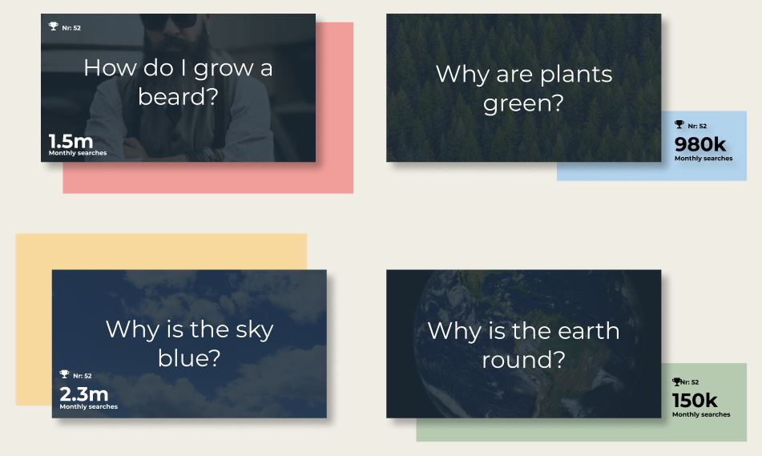

# Allan Gamal

  <h2>100 Days of Code Challange</h2>
  <p>This is part of Alexander Kallaway's <a href="https://github.com/Kallaway/100-days-of-code">100DaysOfCode</a> challange</p>

  <h2>Challange</h3>
    <p>Code 1 hour daily for the next 100 days</p>

   <h2>Starting Point</h3>
     <ul>
    <li>Some acquaintance with HTML and CSS</li>
        <li>Like the idea being creative and build things, with or without code</li>
        <li>No other prior experience with coding</li>
        <li>No prior experience being creative</li>
        <li>No prior experience being continuously part of new projects</li>

</ul>

  <h2>Goals</h2>
    <ul>
        <li>Learn and develop a rock solid understanding of the core HTML, CSS and JavaScript fundumentals</li>
        <li>Expand portfolio</li>
        <li>Get acquainted with Github</li>
        <li>Get acquainted with the Twitter dev community</li>
        <li>Develop my creative side</li>
        <li>Forming a habit of coding and creating regularly</li>
        <li>Forming a habit of starting and following-through ideas/projects</li>

   </ul>
---

## 77. Project Pearson Correlation Coefficient, chart

### Day 77: Aug 25, 2020

**Today's Progress and Thoughts**:

Remade the chart with chart.js. Worked with som data structures and added a regression line in my scatterplot. 


**Link to Work**

- [Code](https://github.com/AllanGamal/Pearson-Correlation-Coefficient/tree/master) to site on GitHub


## 76. Project Pearson Correlation Coefficient, chart

### Day 76: Aug 24, 2020

**Today's Progress and Thoughts**:

Still tinkering with the chart with chart.js. Managed to get a scatter plot after trying to make sense of the chart.js documentation. 


**Link to Work**

- [Code](https://github.com/AllanGamal/Pearson-Correlation-Coefficient/tree/master) to site on GitHub


## 75. Project Pearson Correlation Coefficient, chart

### Day 75: Aug 23, 2020

**Today's Progress and Thoughts**:

Having done alot of data structures, I now seek to display it in a chart, with chart.js. Still figuring out how it works. Will be a scatter plot


**Link to Work**

- [Code](https://github.com/AllanGamal/Pearson-Correlation-Coefficient/tree/master) to site on GitHub


## 74. Project Pearson Correlation Coefficient, validation and styling

### Day 74: Aug 22, 2020

**Today's Progress and Thoughts**:

Tweaking some data structures, and doing some input validation, only accepting numbers, and styling to the table.


**Link to Work**

- [Code](https://github.com/AllanGamal/Pearson-Correlation-Coefficient/tree/master) to site on GitHub


## 73. Project Pearson Correlation Coefficient, calculate function

### Day 73: Aug 21, 2020

**Today's Progress and Thoughts**:

Behind the scene calculation function done for Project Pearson Correlation Coefficient, super fun!

**Link to Work**

- [Code](https://github.com/AllanGamal/Pearson-Correlation-Coefficient/tree/master) to site on GitHub


## 72. Project Pearson Correlation Coefficient, calculate button, data storages

### Day 72: Aug 20, 2020

**Today's Progress and Thoughts**:

Added a calc-btn, to calculate the Project Pearson Correlation Coefficient and the regression line. This is where the fun, but hard part start, math and data structures! Only got to made some data storage magament done.

**Link to Work**

- [Code](https://github.com/AllanGamal/Pearson-Correlation-Coefficient/tree/master) to site on GitHub


## 71. Project Pearson Correlation Coefficient, remove row complete

### Day 71: Aug 19, 2020

**Today's Progress and Thoughts**:

Remove row functionallity partially completed

**Link to Work**

- [Code](https://github.com/AllanGamal/Pearson-Correlation-Coefficient/tree/master) to site on GitHub


## 70. Project Pearson Correlation Coefficient, remove row functionallity partially added

### Day 70: Aug 18, 2020

**Today's Progress and Thoughts**:

Remove row functionallity partially added on a table, really struggeled with this one, but I think I got it now, added a class (n) for every new row and select the buttons parent node id to check if its in a array to remove. Will finish tomorrow

**Link to Work**

- [Code](https://github.com/AllanGamal/Pearson-Correlation-Coefficient/tree/master) to site on GitHub


## 69. Project Pearson Correlation Coefficient, remove row button adde

### Day 69: Aug 17, 2020

**Today's Progress and Thoughts**:

Added button to remove row / datapoints, altough still without functionality. Still figuring out how to do this correct. 


**Link to Work**

- [Code](https://github.com/AllanGamal/Pearson-Correlation-Coefficient/tree/master) to site on GitHub


## 68. Project Pearson Correlation Coefficient, new project!!

### Day 68: Aug 16, 2020

**Today's Progress and Thoughts**:

New project! Doing a site where you can feed numbers in and out you will get Pearson Correlation Coefficient and regression line calculated, with some nice charts displayed.  Started doing a table with a button for adding rows/datapoints. 

**Link to Work**

- [Code](https://github.com/AllanGamal/Pearson-Correlation-Coefficient/tree/master) to site on GitHub


## 67. Project why google, site completed, waiting for upload

### Day 67: Aug 15, 2020

**Today's Progress and Thoughts**:

Some more mediaqueries, and remade some flexboxes to more appropioate grid in this case. Will maybe upload page tomorrow

**Link to Work**

- [Code](https://github.com/AllanGamal/whygooglewhy) to site on GitHub


## 66. Project why google, time of day

### Day 66: Aug 14, 2020

**Today's Progress and Thoughts**:

Making a functin, showing what day it is.

**Link to Work**

- [Code](https://github.com/AllanGamal/whygooglewhy) to site on GitHub


## 65. Project why google, clock

### Day 65: Aug 13, 2020

**Today's Progress and Thoughts**:

Making a clock, showing time in real time.

**Link to Work**

- [Code](https://github.com/AllanGamal/whygooglewhy) to site on GitHub


## 64. Project why google, get ip

### Day 64: Aug 12, 2020

**Today's Progress and Thoughts**:

Using a api to display my ip on page. Only a couple of lines of code, but I have no idea how it works, I just copied it and tweeked it til it worked. 

**Link to Work**

- [Code](https://github.com/AllanGamal/whygooglewhy) to site on GitHub


## 63. Project why google, sticky navbar

### Day 63: Aug 11, 2020

**Today's Progress and Thoughts**:

Making a sticky navbar when scrolling down past first page with javascript!

**Link to Work**

- [Code](https://github.com/AllanGamal/whygooglewhy) to site on GitHub


## 62. Project why google, responsive design

### Day 62: Aug 10, 2020

**Today's Progress and Thoughts**:

In my content website im doing now, I did all my lists and cards in html/css. Big mistake, should just have started in javascript, made the list there, and ad them later to html since the data is going to be dynamically generated in html, which is what I did today. 

**Link to Work**

- [Code](https://github.com/AllanGamal/whygooglewhy) to site on GitHub


## 61. Project why google, responsive design

### Day 61: Aug 9, 2020

**Today's Progress and Thoughts**:

Made my search button expand at click, looks very sleek. Took me forever to get right

**Link to Work**

- [Code](https://github.com/AllanGamal/whygooglewhy) to site on GitHub

## 60. Project why google, responsive design

### Day 60: Aug 8, 2020

**Today's Progress and Thoughts**:

Working with media querys, making everything responsive!

**Link to Work**

- [Code](https://github.com/AllanGamal/whygooglewhy) to site on GitHub

## 59. Project why google

### Day 59: Aug 7, 2020

**Today's Progress and Thoughts**:

Making all the link work. Was planning to make multiple pages, but I just want to finish this and do a long one page site. Making the link jump to the right section

**Link to Work**

- [Code](https://github.com/AllanGamal/whygooglewhy) to site on GitHub

## 58. Project why google, content designs

### Day 58: Aug 6, 2020

**Today's Progress and Thoughts**:

Made a simple content layout in grid, where in a section text is on the right side, and image on the left. And for every new section the text and image will be swapped. 

**Link to Work**

- [Code](https://github.com/AllanGamal/whygooglewhy) to site on GitHub


## 57. Project why google, table design completed

### Day 57: Aug 5, 2020

**Today's Progress and Thoughts**:

Completed my table design. I really made it more complicated than it should have been when using css grid over table. table rules. Also made some hover animations (:


  

**Link to Work**

- [Code](https://github.com/AllanGamal/whygooglewhy) to site on GitHub


## 56. Project why google, table designs

### Day 56: Aug 4, 2020

**Today's Progress and Thoughts**:

Trying out some table designs with css grid. My v.999 is just as ugly as my v.1. 

**Link to Work**

- [Code](https://github.com/AllanGamal/whygooglewhy) to site on GitHub

## 55. Project why google, card designs completed

### Day 55: Aug 3, 2020

**Today's Progress and Thoughts**:

Final card designs! Made with grid, to offset the color and the image, and also make some hoveranimations!


**Link to Work**

- [Code](https://github.com/AllanGamal/whygooglewhy) to site on GitHub


## 54. Project why google, card designs

### Day 54: Aug 2, 2020

**Today's Progress and Thoughts**:

Trying out some card designs!





**Link to Work**

- [Code](https://github.com/AllanGamal/whygooglewhy) to site on GitHub


## 53. Project why google, card designs

### Day 53: Aug 1, 2020

**Today's Progress and Thoughts**:

Trying out some card designs!


**Link to Work**

- [Code](https://github.com/AllanGamal/whygooglewhy) to site on GitHub

## 52. Project why google, intro/welcome/summary page completed

### Day 52: July 31, 2020

**Today's Progress and Thoughts**:

Intropage completed! Made it super simple, with text div very narrow, and a simple background color. 


**Link to Work**

- [Code](https://github.com/AllanGamal/whygooglewhy) to site on GitHub 

## 51. Project why google, intro/welcome/summary page

### Day 51: July 30, 2020

**Today's Progress and Thoughts**:

Working added a intropage, with a welcome/summary text. Will be finetune it more tomorrow

**Link to Work**

- [Code](https://github.com/AllanGamal/whygooglewhy) to site on GitHub 

## 50. Project why google, hero image continued

### Day 50: July 29, 2020

**Today's Progress and Thoughts**:

Dont with the hero image and feel like im done with the homepage. Splited my image in 2, and place them in a grid, making the images slide in from left and right with keyframes to make cool animations. 


**Link to Work**

- [Code](https://github.com/AllanGamal/whygooglewhy) to site on GitHub 

## 49. Project why google, hero image

### Day 49: July 28, 2020

**Today's Progress and Thoughts**:

Playing around with some different designs for hero image and animation, making it slide in from the side with key frames. 

**Link to Work**

- [Code](https://github.com/AllanGamal/whygooglewhy) to site on GitHub 

## 48. Project why google, hero image

### Day 48: July 27, 2020

**Today's Progress and Thoughts**:

Added a hero image today, but not that happy, going to modify apperance tomorrow

**Link to Work**

- [Code](https://github.com/AllanGamal/whygooglewhy) to site on GitHub 

## 47. Project why google, nav 

### Day 47: July 26, 2020

**Today's Progress and Thoughts**:

Made some modifications on my nav from yesterday, making a search button and other animations with border-bottom, and all done with flex-box.


**Link to Work**

- [Code](https://github.com/AllanGamal/whygooglewhy) to site on GitHub 
   
## 46. Javascript30 challange and new project!

### Day 46: July 25, 2020

**Today's Progress and Thoughts**:

Started a new project. This time I just want to put up a content site, that is decent looking site, just to demostrate that I am able to handle the html and css/scss basics, and might add some javascript functions to site. 
So today i just made the nav! 

**Link to Work**

- [Code](https://github.com/AllanGamal/whygooglewhy) to site on GitHub  

## 45. Javascript30 challange

### Day 45: July 24, 2020

**Today's Progress and Thoughts**:

Javascript30 challange completed. Made a wack a mole game today. Had a lot of fun, and the things a take away from this challange is getting alot of hands on on the fundementals, and getting som ideas as a bonus!

**Link to Work**

- [Code](https://github.com/AllanGamal/javaScript30) to javascript30 on GitHub  

## 44. Javascript30 challange

### Day 44: July 23, 2020

**Today's Progress and Thoughts**:

Part of javascript30 challange completed. Greating a coundown timer! That will show us in a certain path that will include break, lunches or whatever. 

**Link to Work**

- [Code](https://github.com/AllanGamal/javaScript30) to javascript30 on GitHub  

## 43. Javascript30 challange

### Day 43: July 22, 2020

**Today's Progress and Thoughts**:

Part of javascript30 challange completed. Making a video speed controller! Playing around with mousemove event and html5 video, to controll how fast the video goes. 

**Link to Work**

- [Code](https://github.com/AllanGamal/javaScript30) to javascript30 on GitHub         

## 42. Javascript30 challange

### Day 42: July 21, 2020

**Today's Progress and Thoughts**:

Part of javascript30 challange completed. Click and drag! Getting familiar with mouseevent and mouseposition.

**Link to Work**

- [Code](https://github.com/AllanGamal/javaScript30) to javascript30 on GitHub      

## 41. Javascript30 challange

### Day 41: July 20, 2020

**Today's Progress and Thoughts**:

Part of javascript30 challange completed. Making drop-down box backgrounds transition from box to box, two different elements.

**Link to Work**

- [Code](https://github.com/AllanGamal/javaScript30) to javascript30 on GitHub   

## 40. Javascript30 challange

### Day 40: July 19, 2020

**Today's Progress and Thoughts**:

Part of javascript30 challange completed. Not building anything today, just playing around with addEventListener, eventcaptuaring and bubbling

**Link to Work**

- [Code](https://github.com/AllanGamal/javaScript30) to javascript30 on GitHub

## 39. Javascript30 challange

### Day 39: July 18, 2020

**Today's Progress and Thoughts**:

Part of javascript30 challange completed. Sticked nav! I got this nav that has a position of relative, and with javascript I change the position to sticky when scrolling down, so the nav is always visable!

**Link to Work**

- [Code](https://github.com/AllanGamal/javaScript30) to javascript30 on GitHub

## 38. Javascript30 challange

### Day 38: July 17, 2020

**Today's Progress and Thoughts**:

Part of javascript30 challange completed. Today I playted around with a speech synhesis API that come with most modern browsers, making text to voice, with pitch and rate variables. 

**Link to Work**

- [Code](https://github.com/AllanGamal/javaScript30) to javascript30 on GitHub

## 37. Javascript30 challange

### Day 37: July 16, 2020

**Today's Progress and Thoughts**:

Part of javascript30 challange completed, making box backgrounds transition from box to box, two different elements, since you cant just transition the background from one to another. Doing this by figuring out the width, height and where the lement is positioned on the page.

**Link to Work**

- [Code](https://github.com/AllanGamal/javaScript30) to javascript30 on GitHub

## 36. Javascript30 challange

### Day 36: July 15, 2020

**Today's Progress and Thoughts**:

Part of javascript30 challange completed, geolocation! I didn't actually get it to work on my computer, since my browser dosen't want to give me premission to use my location, but i did follow through this section of javascript30 anyway

**Link to Work**

- [Code](https://github.com/AllanGamal/javaScript30) to javascript30 on GitHub

## 35. Javascript30 challange

### Day 35: July 14, 2020

**Today's Progress and Thoughts**:

Part of javascript30 challange completed, speech detection! Doing it straight in the browser, without any external libaries or APIs!

**Link to Work**

- [Code](https://github.com/AllanGamal/javaScript30) to javascript30 on GitHub

## 34. Javascript30 challange

### Day 34: July 13, 2020

**Today's Progress and Thoughts**:

Part of javascript30 challange completed, photobooth with javascript! Using a webcam video feed in a canvas element, and once it is in a ncanvas element we can start adding different effects!

**Link to Work**

- [Code](https://github.com/AllanGamal/javaScript30) to javascript30 on GitHub
## 33. Javascript30 challange

### Day 33: July 12, 2020

**Today's Progress and Thoughts**:

Part of javascript30 challange completed, adding up time with reduce. Helpful lesson using a combonation of map and reduce. 

**Link to Work**

- [Code](https://github.com/AllanGamal/javaScript30) to javascript30 on GitHub
## 32. Javascript30 challange

### Day 32: July 11, 2020

**Today's Progress and Thoughts**:

Part of javascript30 challange completed, sorting array values by name, ignoring all the "the", "a", and "an" if it's beforce the sentence/namve value. 

**Link to Work**

- [Code](https://github.com/AllanGamal/javaScript30) to javascript30 on GitHub
## 31. Javascript30 challange

### Day 31: July 10, 2020

**Today's Progress and Thoughts**:

Part of javascript30 challange completed, working a text shadow that follows the mouse pointer using mousemove offsetWidth- and Height.

**Link to Work**

- [Code](https://github.com/AllanGamal/javaScript30) to javascript30 on GitHub
## 30. Javascript30 challange

### Day 30: July 9, 2020

**Today's Progress and Thoughts**:

Part of javascript30 challange completed, working with local storage, where you can add items on the page will still be there when refreshing the page. 

**Link to Work**

- [Code](https://github.com/AllanGamal/javaScript30) to javascript30 on GitHub

## 29. Javascript30 challange

### Day 29: July 8, 2020

**Today's Progress and Thoughts**:

Part of javascript30 challange completed, javascripts reference vs copys. Been learning today important differences on how you copy, and how you refrence an array or an object and it sub levels.

**Link to Work**

- [Code](https://github.com/AllanGamal/javaScript30) to javascript30 on GitHub
## 28. Javascript30 challange

### Day 28: July 7, 2020

**Today's Progress and Thoughts**:

Part of javascript30 challange completed, making images glide and fade in from the side by translate them on and off screen when scrolling up and down, and using 
offsetTop property that returns the top position (px) relative to the top of the parent element.

**Link to Work**

- [Code](https://github.com/AllanGamal/javaScript30) to javascript30 on GitHub

## 27. Javascript30 challange

### Day 27: July 6, 2020

**Today's Progress and Thoughts**:

Part of javascript30 challange completed, and an empty page with key sequence detection to trigger an action! Fairly easy code, but valuable!

**Link to Work**

- [Code](https://github.com/AllanGamal/javaScript30) to javascript30 on GitHub

## 26. Javascript30 challange

### Day 26: July 5, 2020

**Today's Progress and Thoughts**:

Part of javascript30 challange completed, html5 custom made video player, by hiding the video playser controls and make som own custom made. 

**Link to Work**

- [Code](https://github.com/AllanGamal/javaScript30) to javascript30 on GitHub

## 25. Javascript30 challange

### Day 25: July 4, 2020

**Today's Progress and Thoughts**:

Part of javascript30 challange completed, hold shift and check checkboxes. So be able to shift and press checkbox to select every checkbox in between. The code was not that hard, but it did take som brainpower. Have to use querySelector**All**, and use forEach to loop through every checkbox only to check it. 

**Link to Work**

- [Code](https://github.com/AllanGamal/javaScript30) to javascript30 on GitHub
## 24. Javascript30 challange

### Day 24: July 3, 2020

**Today's Progress and Thoughts**:

Part of javascript30 challange completed. Very hande dev tools learnt today, like:

console.:
- warn
- error
- table
- group
- count
- time


**Link to Work**

- [Code](https://github.com/AllanGamal/javaScript30) to javascript30 on GitHub

## 23. Javascript30 challange

### Day 23: July 2, 2020

**Today's Progress and Thoughts**:

Part of javascript30 challange made. Making a canvas. Learnt today that you can reverse a value by "x = !x", instead of doing alot of if statements, and that you can shorten your code by instead of doing like this:
```
x = a;
b = b;
 ```
You can do it like this instead, in one line:
```
[x, y] = [a, b]
 ```

**Link to Work**

- [Code](https://github.com/AllanGamal/javaScript30) to javascript30 on GitHub

## 22. Javascript30 challange

### Day 22: July 1, 2020

**Today's Progress and Thoughts**:

Part of javascript30 challange made. Playing around with some newly introduced array methods, like some() that checks if any of key-value pairs is existing in an array. And the we have the every() that checks if every key-value pairs match to wanted value. 
And find() to get an object from the value

**Link to Work**

- [Code](https://github.com/AllanGamal/javaScript30) to javascript30 on GitHub

## 21. Javascript30 challange

### Day 21: June 30, 2020

**Today's Progress and Thoughts**:

Challange part of javascript30 done. Working a little bit with json today. I am thinking that I should maybe stop this challange (javascript30), since it seems a little bit beyond my capabilities. Im thinking about go back to my book and keep reading/learning the fundementals.

**Link to Work**

- [Code](https://github.com/AllanGamal/javaScript30) to javascript30 on GitHub

## 20. Javascript30 challange

### Day 20: June 29, 2020

**Today's Progress and Thoughts**:

Challange part of javascript30 made, nothing really new here

**Link to Work**

- [Code](https://github.com/AllanGamal/javaScript30) to javascript30 on GitHub

## 19. Javascript30 challange

### Day 19: June 28, 2020

**Today's Progress and Thoughts**:

Doing alot of repetition of different methods, like filter(), map(), sort() and reduce(). Will be coming back to this exercise since it is very valuable

**Link to Work**

- [Code](https://github.com/AllanGamal/javaScript30) to javascript30 on GitHub

## 18. Javascript30 challange

### Day 18: June 27, 2020

**Today's Progress and Thoughts**:

In this project I played around with input and input values, and addEventListener "change" and "mousemove".

**Link to Work**

- [Code](https://github.com/AllanGamal/javaScript30) to javascript30 on GitHub

## 17. Javascript30 challange

### Day 17: June 26, 2020

**Today's Progress and Thoughts**:

Made a clock today, making me familiar with time methods. 

**Link to Work**

- [Code](https://github.com/AllanGamal/javaScript30) to javascript30 on GitHub

## 16. Javascript30 challange

### Day 16: June 25, 2020

**Today's Progress and Thoughts**:

In lack of project ideas I jumped the javascript30 challange, and completed the first project. A drum kit

**Link to Work**

- [Code](https://github.com/AllanGamal/javaScript30) to javascript30 on GitHub

## 15. Project form validator completed

### Day 15: June 24, 2020

**Today's Progress and Thoughts**:

Javascript file added, really didn't learn anything today. I need more of optimal projects/challanges, since I feel like I am standing still at the moment. lets see what tomorrow have to offer.


**Link to Work**

- [Code](https://github.com/AllanGamal/form-validation) to form validation on GitHub

## 14. Project form validator
   

### Day 14: June 23, 2020

**Today's Progress and Thoughts**:

Started a new simple (I think) project. A form validator.
To this project I'm going to take with me lessons from before, presetting classes in the css (scss) file that is going to be later used, rather than doing it all in javascript, so I can just toggle between classes. 

**Link to Work**

- [Code](https://github.com/AllanGamal/form-validation) to form validation on GitHub
   
## 13. Project Expense manager completed

   

### Day 13: June 22, 2020

**Today's Progress and Thoughts**:

Functionality of removing items from history added, and therefore project completed. 

The most valuable thing for me in this project was getting experience going through the javascript fundementals. Although the code is a mess, my lesson to next project is to not be afraid of rewrite the code to a better strategy, since in the long run it will be easier to follow trough. 

**Link to Work**

- [Code](https://github.com/AllanGamal/expense-manager) to expense manager on GitHub

## 12. Project Expense manager continues

### Day 12: June 21, 2020

**Today's Progress and Thoughts**:

Added expense- and income objects and id to to each action(income/expense), and change the balane formula to calculate from the objects and not the textcontent. This should make it easier to remove items from the list without the math of the balance fail. 

**Link to Work**

- [Code](https://github.com/AllanGamal/expense-manager) to expense manager on GitHub
   
## 11. Project Expense manager continues

### Day 11: June 20, 2020

**Today's Progress and Thoughts**:

I've come to a point where the whole code is a mess. Much that is without comments, and alot of code is doubles. Altogh I will not clean up this code, I shall walk away with the lesson to be more careful to begin with.

Also I am a little stuck at the moment, coing to think about it tonight and try to solve it tomorrow

**Link to Work**

- [Code](https://github.com/AllanGamal/expense-manager) to expense manager on GitHub   
   
## 10. Project Expense manager

### Day 10: June 19, 2020

**Today's Progress and Thoughts**:

Started a new project today, expense manager. I only made the basic index and styling setup. I feel like I am pretty (relative) good at css grid and flexbox. 

Also today I've passed the 10% mark through the 100daysofcode challange. I really feel like this shouldn't be too hard to complete.

**Link to Work**

- [Code](https://github.com/AllanGamal/expense-manager) to expense manager on GitHub   
   
## 9. Project game hangman completed
 

### Day 9: June 18, 2020

**Today's Progress and Thoughts**:

Learnt tons during this project! I sure did underestimate how hard it would be, and how much code it would take to finish this.

I did get stuck for a good while trying to change properties of several divs with same class, not realising there were a dedicated selector (document.querySelectorAll("...")) for this purpose, and that the divs of the given class using this selector is bunted in a node, or a array if you will, and that I have to loop through the array to change the propertie for all the divs of the given class.


**Link to Work**

- [Code](https://github.com/AllanGamal/hangman) to hangman on GitHub   
- [Article](https://css-tricks.com/snippets/javascript/loop-queryselectorall-matches/) on how you loop elements using querySelectorAll.   

## 8. Project game hangman started

### Day 8: June 17, 2020

**Today's Progress and Thoughts**:

Started a game project this time, hangman! I only made a simple setup for the index, styling and images... To generate all the words I could use html, but I think its more effective if I just javascript to generate them (given that I learn how to do that).

**Link to Work**

- [Code](https://github.com/AllanGamal/hangman) to hangman on GitHub

## 7. Project tip calculator completed

 

### Day 7: June 16, 2020

**Today's Progress and Thoughts**:

Just finished my first (small) javascript project. A tip calculator! Fairly easy code. Just a couple formulas needed. It is responsive but do have som alignments "problems" that I do not care about to fix, since one of my mission is to get so musch javascript experience as possible.
**Link to Work**

- [Code](https://github.com/AllanGamal/tip-calculator) to tip calculator on GitHub

## 6. Project tip calculator, first project!

### Day 6: June 15, 2020

**Today's Progress and Thoughts**:

Started my first javascript based project, altough today I only made the UI in html and css and will add javascript tomorrow, hopefully.

**Link to Work**

- [Code to tip calculator](https://github.com/AllanGamal/tip-calculator) on GitHub

## 5. Objects and arrays continues

### Day 5: June 14, 2020

**Today's Progress and Thoughts**:

Learned about web interactions and DOMs. How to manipulate and create documents content, structure and formating. Im starting to feel I know some of the core foundation and am ready to work on small projects. Project based learning is far more effective for me to learn and keep up the motivation to learn.

## 4. Objects and arrays continues

### Day 4: June 13, 2020

**Today's Progress and Thoughts**:

Continue to learn more about array and objects, and about some of the Math object, rest parametres and how to read string properties. All very handy

**Link to Work**

- [Some code](https://github.com/AllanGamal/eloquent-javascript-solutions/tree/master/Chapter%204) on GitHub

## 3. Objects and arrays

### Day 3: June 12, 2020

**Today's Progress and Thoughts**:

Learning about array and objects. Which is a way to group several values into a single value, and making it possible to iterate over arrays using for-loops.

**Link to Work**

- [Some code](https://github.com/AllanGamal/eloquent-javascript-solutions/tree/master/Chapter%204) on GitHub

## 2. Functions

### Day 2: June 11, 2020

**Today's Progress**:

Learning about functions, that can create a function value or can be used to declare a binding and give it a function as a value.

**Thoughts:**

A key today is to understand scopes, as bindings in given scopes behve differently.

**Link to Work**

- [Some code](https://github.com/AllanGamal/eloquent-javascript-solutions/tree/master/Chapter%203) on GitHub

## 1. If and else statements and for and while loops.

### Day 1: June 10, 2020

**Today's Progress**:

Learning about fundumental statements

**Thoughts:**

So far so good. I am a little (barely) familiar with python, and it looks very familiar.

**Link to Work**

- [Some code](https://github.com/AllanGamal/eloquent-javascript-solutions/tree/master/Chapter%202) on GitHub

# 100 Days Of Code - Log

### Day 0: month xx, 2020

**Today's Progress**:

**Thoughts:**
